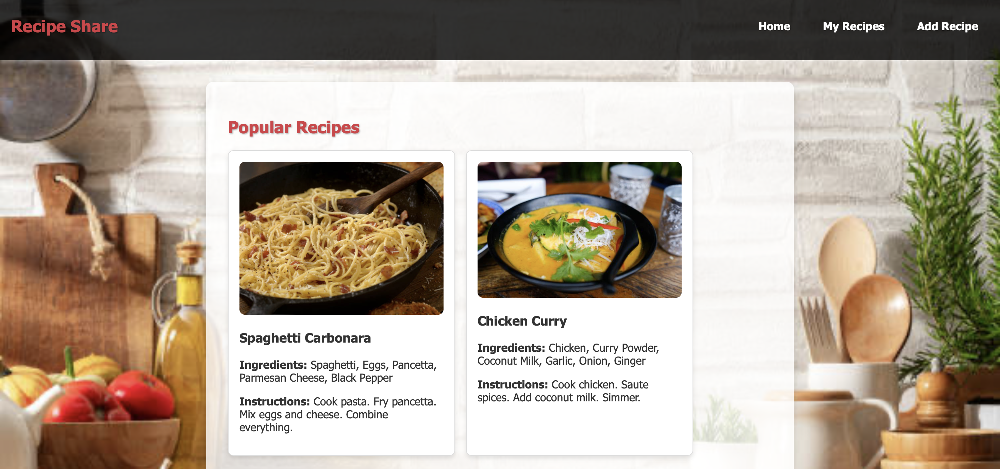
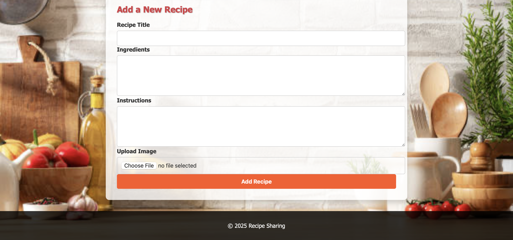

Recipe-Blog
# Recipe Share 🍝

Recipe Share is a full-stack web application that lets users browse, submit, and manage recipes with ease. It features a clean layout, recipe cards, and an intuitive form for adding new recipes — complete with image uploads.

## Features
- View popular recipes with images, ingredients, and instructions
- Add your own recipes using a simple form with file upload
- Responsive and user-friendly design
- Styled with a warm, inviting kitchen theme

## Tech Stack
- HTML5 / CSS3
- JavaScript
- Node.js + Express
- MongoDB

## Screenshots

